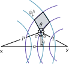

Most of this document follows [Boys 1949](https://royalsocietypublishing.org/doi/10.1098/rspa.1950.0036) and
[McMurchie & Davidson 1978](https://doi.org/10.1016/0021-9991\(78\)90092-X).

## Integrals for HF

Four integrals are necessary for HF

1. The overlap integral: $\langle p | q \rangle$.
2. The kinetic integral: $\langle p | \nabla^2 | q \rangle$.
3. The nuclear integral: $\langle p | V_{\mathrm{nuc}} | q \rangle$.
4. The electron repulsion integrals (ERI): $(pq|rs)$ and $(pr|qs)$.

$p, q, r, s$ are (contracted) Cartesian Gaussians. A Cartesian Gaussian takes the form
$$
\mathrm{C}^{\alpha, \mathbf{x}}_{ijk}(\mathbf{r}) = (r_1 - x_1)^i (r_2 - x_2)^j (r_3 - x_3)^k
\exp(-\alpha (\mathbf{r} - \mathbf{x})^2) = \langle \mathbf{r} | \alpha, \mathbf{x}, i,j,k \rangle, 
$$
and we will not consider contractions for now.

## Overlap

The overlap integral is an integral over the *product of two Cartesian Gaussians*
$$
\langle \beta, \mathbf{y}, i',j',k'| \alpha, \mathbf{x}, i,j,k \rangle
= \int \mathrm{d} \mathbf{r} 
\mathrm{C}^{\beta, \mathbf{y}}_{i'j'k'}(\mathbf{r})
\mathrm{C}^{\alpha, \mathbf{x}}_{ijk}(\mathbf{r}).
$$
Since the product of two Cartesian Gaussians is another Cartesian Gaussian, we
end up integrating just a Cartesian Gaussian. This integral relies on the
observation that derivatives of a bare Gaussian w.r.t. its center span the 
vector space of Cartesian Gaussians. For instance,
$$
\frac{\partial}{\partial x_1}
\exp(-\alpha (\mathbf{r} - \mathbf{x})^2) =2 \alpha (r_1 - x_1) \exp(-\alpha (\mathbf{r} - \mathbf{x})^2)
$$
More generally, the $n^{\mathrm{th}}$ derivative gives the $n^{\mathrm{th}}$ 
Hermite polynomial $\alpha^{n/2} H_n(\sqrt{\alpha} (r_1 -x_1))$ 
$$
\frac{\partial^n }{\partial x_1^n} \exp(-\alpha (\mathbf{r} - \mathbf{x})^2) 
= \alpha^{j/2} H_n(\sqrt{\alpha} (r_1 - x_1)) \exp(-\alpha (\mathbf{r} - \mathbf{x})^2).
$$

The Hermite polynomials form a basis set for polynomials, so we can expand the
polynomial part of the Cartesian Gaussian product in terms of Hermite polynomials as
$$
\begin{aligned}
\mathrm{C}^{\beta, \mathbf{y}}_{i'j'k'}(\mathbf{r})
\mathrm{C}^{\alpha, \mathbf{x}}_{ijk}(\mathbf{r})
&= \exp\left(-\frac{\alpha \beta}{\gamma |\mathbf{x} - \mathbf{y}|^2}\right)
\sum D_{ii'}^m E_{jj'}^n F_{kk'}^p 
\Lambda^{\gamma, \mathbf{z}}_{mnp}(\mathbf{r})\\
\Lambda^{\gamma, \mathbf{z}}_{mnp}(\mathbf{r})
&= \frac{\partial^m}{\partial z_1^m} 
\frac{\partial^n}{\partial z_2^n} 
\frac{\partial^p}{\partial z_3^p} 
\exp(-\gamma (\mathbf{r} - \mathbf{z})^2)
\end{aligned}
$$
We will call the function $\Lambda$ the Hermite Gaussians. The coefficients in
this basis transform can be recursively evaluated as 
$$
\begin{aligned}
\gamma &= \alpha + \beta, \mathbf{z} = \frac{ \alpha \mathbf{x} + \beta \mathbf{y} }{\gamma}, \\
D_{ii'}^m &= \frac{1}{2\gamma} D_{i-1,i'}^{m-1} + (r_1 - x_1) D_{i-1,i'}^m + (m+1) D_{i-1,i'}^{m+1},\\
D_{0i'}^m &= \frac{1}{2\gamma} D_{0,i'-1}^{m-1} + (r_1 - y_1) D_{0,i'-1}^m + (m+1) D_{0,i'-1}^{m+1},\\
D_{00}^0 &= 1, \text{ and } D_{ii'}^m = 0 \text{ if } m < 0 \text{ or } m > i + i'.
\end{aligned}
$$
This recursion is functionally inverting a sparse and triangular matrix that is the basis conversion
from monomials to the Hermite polynomials.

The overlap integral can be performed through $\Lambda_{mnp}^{\gamma, \mathbf{z}}(\mathbf{r})$ as
$$
\int \mathrm{d} \mathbf{r} \Lambda_{mnp}^{\gamma, \mathbf{z}}(\mathbf{r})
= 
\frac{\partial^m}{\partial z_1^m} 
\frac{\partial^n}{\partial z_2^n} 
\frac{\partial^p}{\partial z_3^p} 
\int \mathrm{d} \mathbf{r} \exp(-\gamma (\mathbf{r} - \mathbf{z})^2)
= \delta_{m0}
\delta_{n0}
\delta_{p0} \left(\frac{\pi}{\gamma}\right)^{3/2}.
$$

<!----
$$
\begin{aligned}
P(x, y, z) \exp(-\alpha (\mathbf{r} - \mathbf{r}_C)^2)
&= \sum_{i,j,k} c_{i,j,k} \alpha^{(i+j+k)/2} H_i(\sqrt{\alpha}(x-x_C))H_j(\sqrt{\alpha}(y-y_C))H_k(\sqrt{\alpha}(z-z_C)) \exp(-\alpha (\mathbf{r} - \mathbf{r}_C)^2) \\
&= \sum_{i,j,k} c_{i,j,k} \frac{\partial^i }{\partial x_c^i}
\frac{\partial^j }{\partial y_c^j}
\frac{\partial^k }{\partial z_c^k}
\exp(-\alpha (\mathbf{r} - \mathbf{r}_C)^2).
\end{aligned}
$$
The coefficients $c_{i,j,k}$ can be found by a matching the monomial
coefficients. This matching is just a basis conversion and can be solved by a
linear solve, which turns out to be a back-substitution for most polynomials
basis including the Hermite polynomial basis. The back-substitution is often
done implicitly through the recursive relations of the Hermite polynomials, which
is conceptually more obscure but may make a difference on performance.
-->

## Kinetic

Since the gradient of a Cartesian Gaussian is another Cartesian Gaussian, the Kinetic
integral is also a Cartesian Gaussian integral, and it can be performed the same 
way as the overlap integral. TODO: put the formulas here for completeness.

<!---
## Product of two (or more) Gaussians

The product of two Gaussians is a Gaussian, and the new coefficients can be found by completing the squares.
$$
\begin{aligned}
&P_1(x, y, z) \exp(-\alpha_1 (\mathbf{r - \mathbf{r}_1}))
P_2(x, y, z) \exp(-\alpha_2 (\mathbf{r - \mathbf{r}_2})) \\
=& P_1(x, y, z) P_2(x, y, z) 
\exp\left(-\frac{\alpha_1 \alpha_2}{\alpha_1 + \alpha_2} (\mathbf{r}_1 - \mathbf{r}_2)^2 \right)
\exp\left(-(\alpha_1 + \alpha_2) \left(\mathbf{r} - \frac{\alpha_1 \mathbf{r_1} + \alpha_2 \mathbf{r}}{\alpha_1 + \alpha_2} \right)\right)\\
\triangleq& P_3(x,y,z) \exp(-\alpha_3 (\mathbf{r} - \mathbf{r}_3)^2)\\
\end{aligned}
$$
-->

## Nuclear

The nuclear integral also involves a product of two Cartesian Gaussians. After
converting the product to the Hermite Gaussians, the integral boils down to evaluating
$$
\int \mathrm{d} \mathbf{r'} \Lambda_{mnp}^{\gamma, \mathbf{z}}(\mathbf{r'}) \frac{1}{|\mathbf{r'}-\mathbf{r}|},
$$
where $\mathbf{r}$ is the nuclear coordinate. This is the Coulomb potential of a
charge distribution at the point $\mathbf{r}$. The building block for this
integral is the potential of a uniformly charged sphere.

### The electrostatic potential of a uniformly charged sphere.

In general, for a charge distribution $\sigma \rho(\mathbf{r})$, where $\sigma$
is the total charge and $\rho(\mathbf{r})$ is a normalized density, the
potential energy can be evaluated as
$$
V(\mathbf{r}) = \sigma \int \mathrm{d} \mathbf{r'} \frac{\rho(\mathbf{r}')}{|\mathbf{r'} - \mathbf{r}|}.
$$
For a uniformly charged sphere in 3D, the density is $\rho(\mathbf{r}) =
\sigma \delta(r-R)$. Its potential at $\mathbf{r}$ can be analytically evaluated
in the spherical coordinates,

$$
\begin{aligned}
V(r)
&= \sigma \int \mathrm{d}r' r'^2\sin \theta \mathrm{d} \theta \mathrm{d} \phi  \frac{\delta(r' - R)} {R^2 + r^2 - 2 Rr \cos \theta}
= \sigma \int \frac{R^2 \sin \theta \mathrm{d} \theta \mathrm{d} \phi}{ R^2 + r^2 - 2 Rr \cos \theta} \\
&= \frac{2\pi \sigma}{r} \left(\sqrt{(R + r)^2} - \sqrt{(R -r)^2} \right)
=\begin{cases}
\frac{R^2 \sigma}{r} \quad \text{if }R < r\\
R \sigma \quad \text{if } R > r
\end{cases}
\end{aligned}
$$

### Gaussian as stacked concentric spheres.

A isotropic Gaussian distribution in 3D $\Lambda_{000}^{\gamma, \mathbf{0}}$ can now 
be viewed as many concentric spheres stacked together
$$
\rho(\mathbf{r}) = \exp(-\gamma r^2) = \int \mathrm{d} R \exp(-\gamma R^2) \delta(r-R).
$$
The potential is then an integral over the stacks
$$
\begin{aligned}
V(\mathbf{r}) &= 4\pi \int_0^r \mathrm{d} R \exp(-\gamma R^2) \frac{\sigma R^2}{r}
+ 4\pi \int_r^{\infty} \mathrm{d} R \exp(-\gamma R^2) \sigma R \\
&= \frac{2 \pi}{\gamma r} \int_{0}^r \exp(-\gamma R^2) \mathrm{d} R
= \frac{2 \pi}{\gamma^{3/2} r} \int_0^{\sqrt{\gamma} r} e^{-t^2} \mathrm{d}t
= \frac{\pi^{3/2} \mathrm{erf}\left(\sqrt{\gamma } r\right)}{2 \gamma ^{3/2} r}.
\end{aligned}
$$
In the past, instead of the error function, the result was written in terms of $u = t/(\sqrt{\gamma} r)$.
$$
V(\mathbf{r}) = \frac{2 \pi}{\gamma} \int_0^1 e^{-\gamma r^2 u^2}\mathrm{d} u \triangleq
\frac{2 \pi}{\gamma} F_0(\gamma r^2). 
$$

The potential of $\Lambda_{mnp}^{\gamma, \mathbf{z}}$ can now be written as
the derivative of $F_0$
$$
\frac{\partial^m}{\partial z_1^m} 
\frac{\partial^n}{\partial z_2^n} 
\frac{\partial^p}{\partial z_3^p} 
 \int \mathrm{d} \mathbf{r} \Lambda_{000}^{\gamma, \mathbf{z}}(\mathbf{r})
 = 
\frac{2\pi}{\gamma} \frac{\partial^m}{\partial z_1^m} 
\frac{\partial^n}{\partial z_2^n} 
\frac{\partial^p}{\partial z_3^p} 
F_0(\gamma |\mathbf{r} -\mathbf{z}|^2)
\triangleq \frac{2\pi}{\gamma} R_{mnp0}.
$$
Calculating $R_{mnp0}$ is efficient with the recursive relations
$$
\begin{aligned}
R_{00pj} &= z_3 R_{00\;p-1\;j+1} + (p-1) R_{00\;p-2\;j+1},\\
R_{0npj} &= z_2 R_{0n-1\;p\;j+1} + (n-1) R_{0\;n-2\;pj+1},\\
R_{mnpj} &= z_1 R_{m-1\;np\;j+1} + (m-1) R_{m-2\;npj+1},\\
R_{000j} &= (-2\gamma)^j F_j(\alpha |\mathbf{r} -\mathbf{z}|^2),\\
F_j(T) &= \Gamma(m) \Gamma(m, T) / (2 T^m), \text{ with } m = j + 1/2,\\
R_{mnpj} &= 0 \text{ if } m < 0 \text{ or } n < 0 \text{ or } p < 0.
\end{aligned}
$$
where $\Gamma(m)$ is the Gamma function and $\Gamma(m, T)$ is the upper
incomplete Gamma function. $F_j(T)$ has a fake singularity at $T=0$, which can
be circumvented by Taylor expanding the expression around $T=0$.

## ERI

Given two isotropic Gaussians $\Lambda_{000}^{\alpha, \mathbf{x}}(\mathbf{r})$ 
and $\Lambda_{000}^{\beta, \mathbf{y}}(\mathbf{r})$, the Coulomb potential 
in between is 
$$
\int \mathrm{d} \mathbf{r} \mathrm{d} \mathbf{r}'
 \frac{1}{|\mathbf{r} - \mathbf{r}'|} 
 \Lambda_{000}^{\alpha, \mathbf{x}}(\mathbf{r})
 \Lambda_{000}^{\beta, \mathbf{y}}(\mathbf{r}')
$$
This integral is performed in the two center bipolar coordinate, where the
coordinate of a point is specified by its distances to $\mathbf{x}$ and
$\mathbf{y}$, which we denote $p$ and $q$, and an azimuthal angle $\phi$. The
volume element is the shaded region, whose area is $\mathrm{d}p
\mathrm{d}q/\sin(\theta)$ with an thickness of $h \mathrm{d}\phi$. $h$ can be
expressed through the area of the triangle as $h = pq \sin(\theta) / a$.
Therefore, the volume element turns out to be $(p q/a) \mathrm{d}p \mathrm{d}q
\mathrm{d}\phi$.

{ width=40% }

Perform the integral over in the bipolar coordinates gives
$$
\begin{aligned}
J &= \int \mathrm{d} \mathbf{r} \Lambda_{000}^{\alpha, \mathbf{x}}(\mathbf{r}) V(\mathbf{r})\\
&= \int (p q/a) \mathrm{d}p \mathrm{d}q \mathrm{d} \phi \Lambda_{000}^{\alpha, \mathbf{x}}(\mathbf{r})
\frac{2 \pi}{\alpha |\mathbf{r} - \mathbf{y}|} \int_{0}^{|\mathbf{r} - \mathbf{y}|} \exp(-\alpha R^2) \mathrm{d} R\\
&= \frac{(2 \pi)^2}{\alpha a}  \int p \exp(-\beta p^2) \mathrm{d}p \mathrm{d}q  
\int_{0}^{q} \exp(-\alpha R^2) \mathrm{d} R\\
&= \frac{(2 \pi)^2}{\alpha a}  
\left(\int_0^a \mathrm{d}q \int_{a-q}^{a+q} \mathrm{d}p + 
\int_a^{\infty} \mathrm{d}q \int_{q-a}^{q+a} \mathrm{d}p\right)
p \exp(-\beta p^2) 
\int_{0}^{q} \exp(-\alpha R^2) \mathrm{d} R\\
&= \frac{(2 \pi)^2}{2 \alpha \beta a}
\left(\int_0^a \mathrm{d}q + \int_a^{\infty} \mathrm{d}q\right)
(\exp(-\beta  (a-q)^2)-\exp(-\beta (a+q)^2))
\int_{0}^{q} \exp(-\alpha R^2) \mathrm{d} R\\
&= \frac{(2 \pi)^2}{2 \alpha \beta a}
\int_{-\infty}^{\infty} \mathrm{d}q \exp(-\beta  (a-q)^2)
\int_{0}^{q} \exp(-\alpha R^2) \mathrm{d} R\\
\end{aligned}
$$
To continue, we use a trick that has never been intuitive to me
$$
\begin{aligned}
J \frac{2 \alpha \beta a}{(2\pi)2} =&\int_{-\infty}^{a} \mathrm{d} a' \int_{-\infty}^{\infty} \mathrm{d}q \frac{\partial }{\partial a'}\exp(-\beta  (a'-q)^2)
\int_{0}^{q} \exp(-\alpha R^2) \mathrm{d} R\\
=&\int_{-\infty}^{a} \mathrm{d} a' \int_{-\infty}^{\infty} \mathrm{d}q \frac{\partial }{\partial q}\exp(-\beta  (a'-q)^2)
\int_{0}^{q} \exp(-\alpha R^2) \mathrm{d} R\\
=&\int_{-\infty}^{a} \mathrm{d} a' 
\left(
\left.\exp(-\beta  (a'-q)^2) \int_{0}^{q} \exp(-\alpha R^2) \mathrm{d} R \right|_{-\infty}^{\infty} +\right.\\
& \left.\int_{-\infty}^{\infty} \mathrm{d}q \exp(-\beta  (a'-q)^2)
\exp(-\alpha q^2) \right)\\
=&\int_{-\infty}^{a} \mathrm{d} a' 
\sqrt{\frac{\pi}{\alpha + \beta}} \exp\left(-\frac{\alpha \beta a'^2}{\alpha + \beta}\right)
\end{aligned}
$$

Write this in terms of $F_0$ yields
$$
J = \frac{2 \pi^{5/2}}{\alpha \beta \sqrt{\alpha + \beta}} F_0\left(
\frac{|\mathbf{x} - \mathbf{y}|^2 \alpha \beta}{\alpha + \beta}
\right).
$$
For general angular momentums, take the derivatives as before
$$
\begin{aligned}
& \int \mathrm{d} \mathbf{r} \mathrm{d} \mathbf{r}'
 \frac{1}{|\mathbf{r} - \mathbf{r}'|} 
 \Lambda_{mnp}^{\alpha, \mathbf{x}}(\mathbf{r})
 \Lambda_{m'n'p'}^{\beta, \mathbf{y}}(\mathbf{r}')\\
 = & 
\frac{\partial^m}{\partial x_1^m} 
\frac{\partial^n}{\partial x_2^n} 
\frac{\partial^p}{\partial x_3^p} 
\frac{\partial^{m'}}{\partial y_1^{m'}} 
\frac{\partial^{n'}}{\partial y_2^{n'}} 
\frac{\partial^{p'}}{\partial y_3^{p'}} J\\
= & \frac{2 \pi^{5/2}}{\alpha \beta \sqrt{\alpha + \beta}} 
(-1)^{m+n+p} R_{m+m'\;n+n'\;p+p'\;0}.
\end{aligned}
$$

<!---

## Gaussian with a polynomial

The potential of a Gaussian (we assume Gaussians to be with a polynomials from here on)
is then
$$
V(\mathbf{r}) = \sum_{i,j,k} c_{i,j,k} \frac{\partial^i }{\partial x_c^i}
\frac{\partial^j }{\partial y_c^j}
\frac{\partial^k }{\partial z_c^k}
\frac{2\pi}{\alpha} F(\alpha (\mathbf{r} - \mathbf{r}_C)^2)
\triangleq \sum_{i,j,k} c_{i,j,k} R_{i,j,k}(\alpha (\mathbf{r} - \mathbf{r}_C)^2).
$$
Note that $R_{i,j,k}$ is a universal set of scalar functions that can potentially be 
fitted instead of analytically evaluated. That being said, $R_{i,j,k}$ is generally 
recursively evaluated for efficient block evaluation.
$$
\begin{aligned}
T &= \alpha (a^2 + b^2 + c^2),\\
R_{0,0,0,n}(T) &= (-2 \alpha)^n F_n(T),\\
F_n(T) &= \int_0^1 u^{2n} e^{-T u^2} \mathrm{d} u,\\
R_{0,0,k+1,n}(T) &= c R_{0,0,k, n+1}  + k R_{0,0,k-1,n+1},\\
R_{0,j+1,k,n}(T) &= b R_{0,j,k, n+1}  + j R_{0,j-1,k,n+1},\\
R_{i+1,j,k,n}(T) &= b R_{i,j,k, n+1}  + i R_{i-1,j,k,n+1},
\end{aligned}
$$
where $F_n(T)$ is to be numerically evaluated as the incomplete Gamma function.

The Coulomb energy between two Gaussians can be similarly derived as
$$
J = \frac{2 \pi^{5/2}}{\alpha_1 \alpha_2 \sqrt{\alpha_1 + \alpha_2}}
\sum_{i,j,k,i',j',k'} c_{i,j,k} d_{i',j',k'}
(-1)^{i'+j'+k'} R_{i + i', j+j', k+k'}\left(\frac{\left(\mathbf{r}_1 - \mathbf{r}_2\right)^2 \alpha_1 \alpha_2}{\alpha_1 + \alpha_2} \right)
$$

-->
